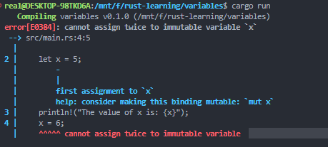
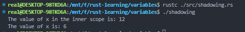

# Programing Concepts In RUST

## Variable 

### Mutablility

Default thì các biến là immutable 
```
    let x = 5;
    println!("The value of x is: {x}");
    x = 6;
    println!("The value of x is: {x}");
}
``` 
Khi chạy `cargo run` thì sẽ gặp lỗi <strong>`cannot assign twice to immutable variable` </strong>



Tuy nhiên, ta có thể khiến biến mutable bằng cách thêm `mut` đằng sau `let`.


### Const

Giống với immutable variables, tuy nhiên:
1. không thể gán thêm `mut` 
2. const có thể được khai báo ở mọi scope, kể cả global scope
3. const không thể chứa giá trị computed at runtime, mà chỉ có thể chứa constant expression ví dụ: </br>
    ```const THREE_HOURS_IN_SECONDS: u32 = 60 * 60 * 3; ```

### Shadowing

Có thể khai báo biến trùng tên với biến cũ. Ta nói biến mới đã <i>shadow</i> biến cũ. Biến 2 overshadow biến 1, khi đó biến 2 sẽ lấy uses của biến 1 cho đến khi biến 2 bị overshadow bởi 1 biến khác hoặc ra ngoài scope. Ví dụ: 
```
fn main() {
    let x = 5;

    let x = x + 1;

    {
        let x = x * 2;
        println!("The value of x in the inner scope is: {x}");
    }

    println!("The value of x is: {x}");
}
```
Output: 



Shadow khác vớI `mut` vì ta sẽ gặp compile error khi ta reassign lại mà không dùng let. Ngoài ra, khi sử dụng shadowing ta cũng có tạo ra một biến mới khác kiểu nhung cùng tên với biến cũ
ví dụ

``` 
    let spaces = "   ";
    let spaces = spaces.len();
```
khi sử dụng `mut`
```
    let mut spaces = "   ";
    spaces = spaces.len(); // lỗi
```
### Data Types
